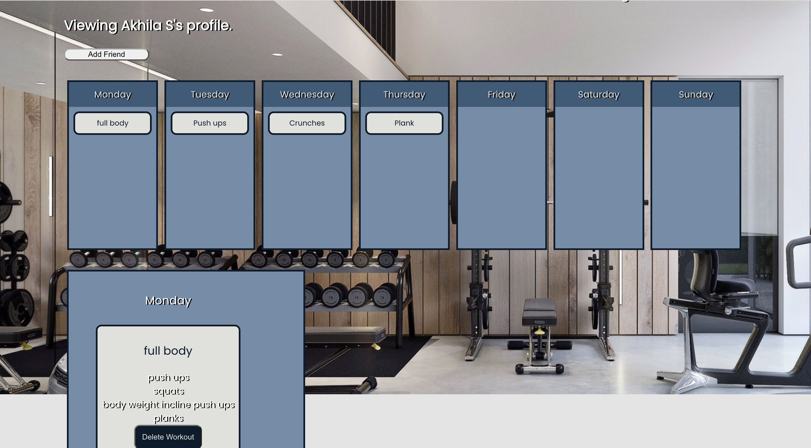

## Description

Fitr is a workout application where the user can post their workout sessions and also share the workouts with their followers.

These workouts are presented in a daily and weekly format where the users can review their exercise routine. 


| ***Home Page***                   | ***Login/Signup Page***                |
| --------------------------------- | ------------------------------- |
|      |  |
| ***Profile Page***                   | ***Friend's List***                |
|  | 


## Table of Contents

* [Technology Used](#technologyused)
* [User Story](#userstory)
* [Repository](#repository)
* [Heroku](#heroku)
* [Tests](#tests)
* [Questions](#questions)


## Technology Used <a name="technologyused"></a>

```.
  HTML - CSS - JavaScript - MongoDB - React - 
  React Router - Bcrypt - Mern Stack - Faker
```


## User Story <a name="userstory"></a>

```text
As a fitr user

I WANT to be able to add excercises to different days of the week 
SO THAT I can have a customized workout plan.

I WANT to be able to share my workouts with others and also follow them 
SO THAT I can view their workouts.
```


## Repository <a name="repository"></a>

https://github.com/SmasherCoder/fitr.git


## Heroku <a name="heroku"></a>

https://fitrfitr.herokuapp.com/


## Tests <a name="tests"></a>
There are currently no tests for this application.


## Questions <a name="questions"></a>

If You have any questions please [**eMail**](mailto:akhilasrinagula@gmail.com) me.

Check out more of our work on
  * [**Akhila's GitHub**](https://github.com/akhilasrinagula)
  * [**Dustin's GitHub**](https://github.com/dustin2400)
  * [**Mekayla's Github**](https://github.com/trujilml)
  * [**Abel's Github**](https://github.com/AKim47)
  * [**Travis's Github**](https://github.com/smashercoder)


Made with ❤️ by Akhila | Dustin | Mekayla | Abel | Travis

    

 

